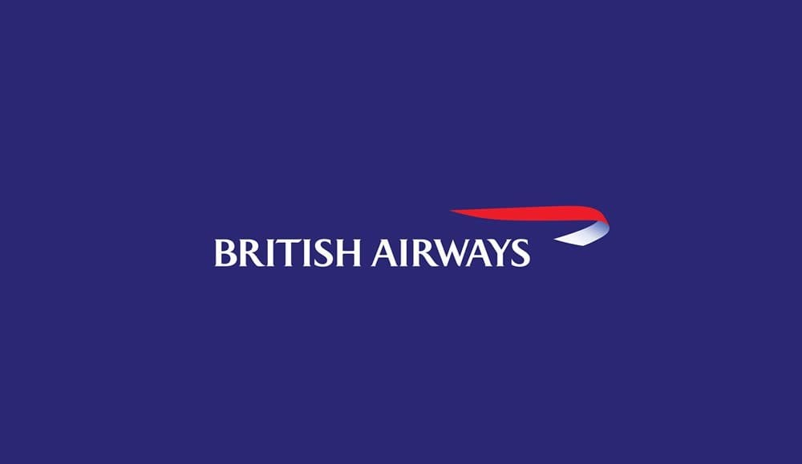
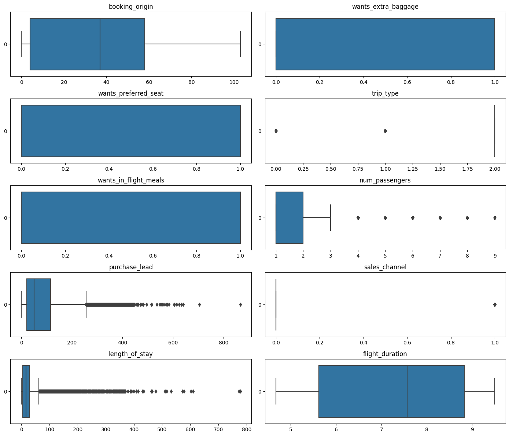

 # British Airways Review Analysis & Prediction ✈️  

## 📌 Project Overview  
This project focuses on analyzing 5,000+ British Airways customer reviews to extract insights that support business strategy.  
A predictive model was developed to identify key factors influencing customer behavior with **97% accuracy**, helping improve customer satisfaction, service management, and commercial optimization.

---
## ✈️ Flight Volume by Day of Week  

Analysis of flight distribution across the week shows the following order (from highest to lowest number of flights):

| Rank | Day        | Volume Trend         |
|-----:|------------|----------------------|
| 1    | **Monday**    | 📈 Highest flights     |
| 2    | **Wednesday** | High                  |
| 3    | **Tuesday**   | Moderately high       |
| 4    | **Thursday**  | Medium                |
| 5    | **Friday**    | Slightly lower        |
| 6    | **Sunday**    | Lower flights         |
| 7    | **Saturday**  | 📉 Lowest flights     |

**Insights**  
Weekdays especially *Monday to Wednesday* that show peak traffic volumes, while weekends have noticeably fewer flights, with *Saturday being the lowest*.

📌 **Conclusion:**  
Saturday shows the lowest activity likely due to a drop in business travel, reduced customer demand, and operational cost optimization by airlines. This aligns with typical weekly travel patterns where mid-week peaks and weekend dips are common.

## 🗣 Sentiment Analysis Results

Customer reviews were classified into three sentiment categories:

| Rank | Sentiment     | Interpretation                           |
|-----:|---------------|-------------------------------------------|
| 1    | **Positive**  | Customers satisfied & had a good experience |
| 2    | **Neutral**   | Mixed or unclear feedback                  |
| 3    | **Negative**  | Dissatisfied customers, pain points raised |

**Insights**  
Most reviews tended to be **positive**, followed by **neutral**, while negative sentiment formed the smallest portion —  
indicating customer satisfaction is generally good, but there is still room for improvement in pain-point areas.

## 🛫 Trip Distribution

Customer trips were categorized into three types, with the distribution as follows:

| Rank | Trip Type      | Volume Trend              |
|-----:|----------------|---------------------------|
| 1    | **Round Trip** | 📈 Highest number of trips |
| 2    | One Way Trip   | Moderate number of trips  |
| 3    | Circle Trip    | 📉 Lowest number of trips |

**Insight:**  
Most customers prefer **Round Trips**, likely due to convenience and package pricing benefits.  
One Way and Circle Trips have fewer bookings, indicating they are less popular options for travelers.

## 💰 Sales Distribution by Channel

**Observation:**  
Internet sales are significantly higher than Mobile sales.

**Analysis:**  
- Users prefer booking via Web due to better usability and larger screens  
- Corporate/business travelers mainly use Web portals  
- Mobile payment flow may be less smooth, reducing mobile conversions  
- Marketing & traffic might be more web-directed  

**Conclusion:**  
Customers show a clear preference for web booking, highlighting the importance of optimizing web experience and corporate-focused channels.

## 📊 Outliers in Box Plots

Box Plots are used to visualize data distribution and detect outliers — points that significantly deviate from the majority of observations.  
In these plots, any point outside the "whiskers" is considered a potential outlier.

### 🧩 Key Features Exhibiting Significant Outliers

| Feature Name      | Outlier Observation                             | Interpretation |
|------------------|-----------------------------------------------|----------------|
| `purchase_lead`   | Numerous points extending towards 800 days    | Most bookings have short lead times, but some customers book flights extremely far in advance (over 2 years). |
| `length_of_stay`  | Numerous points extending towards 800 days    | While most trips are short, a few passengers book exceptionally long stays (months or over a year). |
| `num_passengers`  | Scattered points ranging from 3 up to 9      | Most bookings are for 1–2 passengers. Outliers represent rare, large group bookings. |
| `trip_type`       | Distinct points at 0 and 2                     | Majority of data centers around one trip type (likely Round Trip). Outliers indicate less common or rare trip types. |
| `flight_duration` | Points observed below 5 hours and above 10 hours | Most flights are mid-range; outliers represent very short-haul and very long-haul/international flights. |

**Insight:**  
Outliers should be carefully handled during **data preprocessing**, either through transformation, capping, or removal, depending on their impact on predictive modeling.

## 🔍 Feature Selection Insights  

### 📈 Positive Correlation with Purchase / Satisfaction Decision  
These features were strongly associated with **higher conversion or customer engagement**:

| Feature | Meaning |
|--------|---------|
| `booking_origin` | Country/region customer booked from |
| `wants_extra_baggage` | Customer interest in extra luggage |
| `wants_prefer_seat` | Customer interest in preferred seating |
| `trip_type` | Whether trip is one-way/round-trip etc. |
| `wants_in_flight_meal` | Request for meal service |
| `num_passenger` | Number of passengers in booking |

---

### 📉 Negative Correlation with Purchase / Satisfaction Decision  
Higher values in these features generally reduce probability of purchase or satisfaction:

| Feature | Meaning |
|--------|---------|
| `purchase_lead` | Days between booking & flight date |
| `sales_channel` | Some channels perform worse than others |
| `length_of_stay` | Very long stays correlate negatively |
| `flight_duration` | Longer flights reduce booking likelihood |

---

> **Summary:**  
Customers who actively personalize their bookings — such as selecting preferred seats, requesting extra baggage, or opting for in-flight meals — tend to show stronger buying intent and higher engagement.  
Conversely, factors like long booking lead times, extended trips, and longer flight durations are associated with lower likelihood of purchase or reduced satisfaction.  
By understanding these correlations, airlines can prioritize offerings that drive customer conversion while addressing factors that may discourage bookings.

